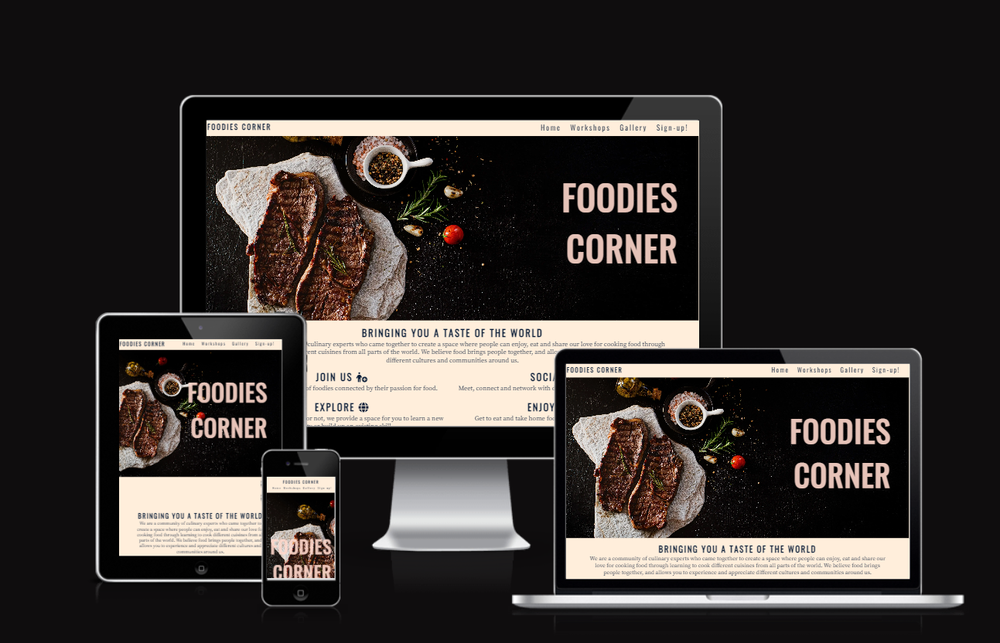
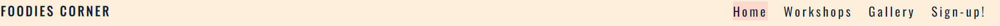
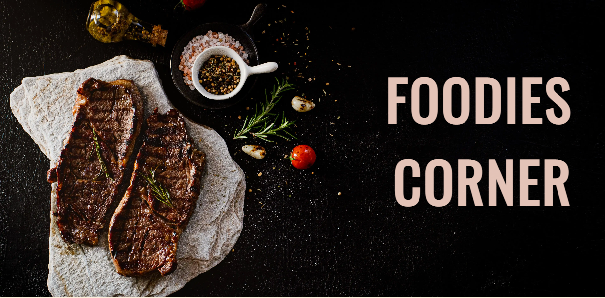
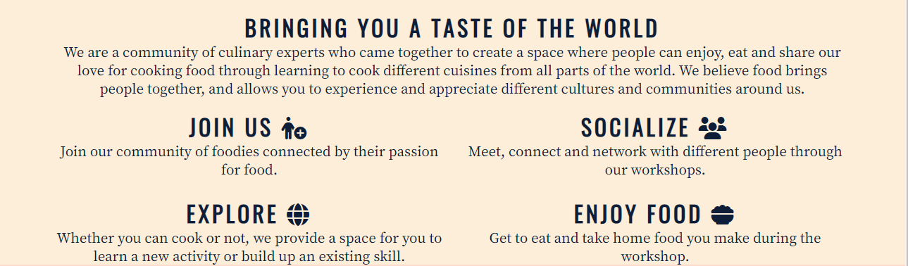
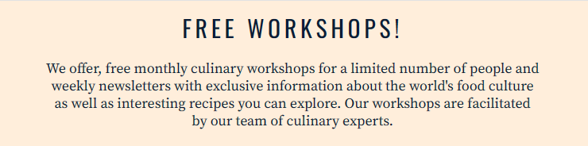
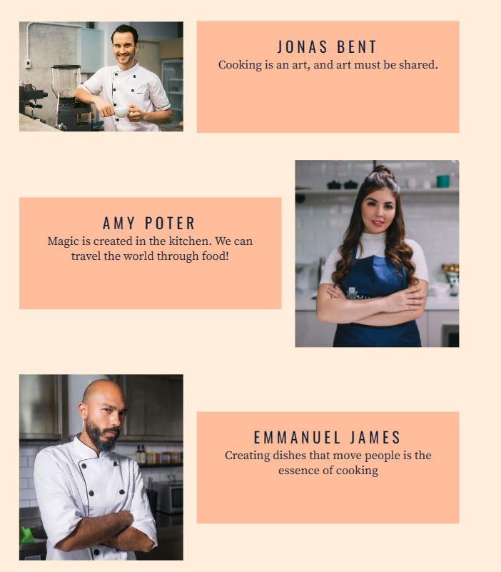
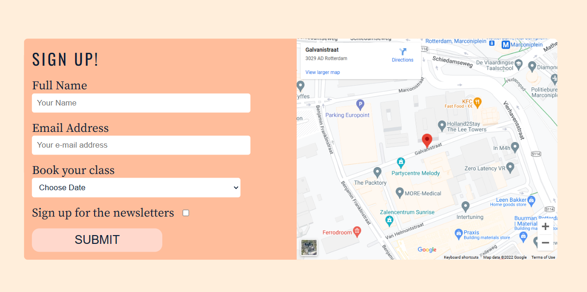
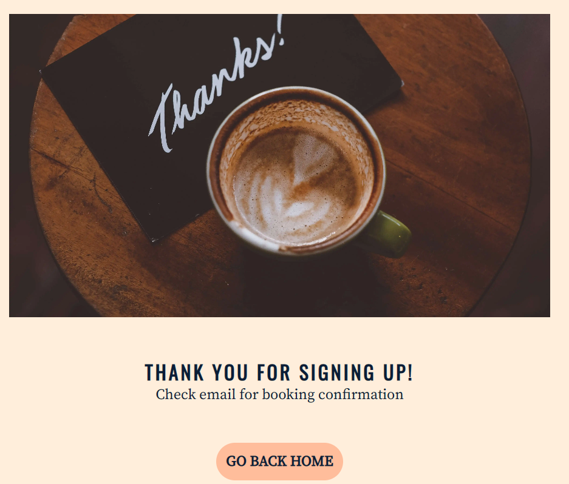

# Foodies Corner 
(Developer Hope Tracy Njoroge)

Foodies Corner is an imagined website targeted towards people who love food and cooking. It aims to provide a space where cooking can be learnt and or improved, as well as a platform to meet and socialize with other food and cooking lovers.

[Visit the Foodies Corner here](https://njorogetracy.github.io/foodies-corner/)

 

## Table of Content 

1. [Project Goals](#project-goals)
    - [Site Owner Goals](#site-owner-goal)
    - [User Goals](#user-goals)
2. [User Experience](#user-experience)
    - [Target Audience](target-audience)
    - [User Stories](user-stories)   
3. [Design](design)
    - [Colour](colour)
    - [Typography](typography)
    - [Wireframes](wireframes)
4. [Features](features)
5. [Testing](testing)
    - [Function Testing](function-testing)
    - [Perfomance](perfomance)
    - [Validation](validation)
    - [HTML](HTML)
    - [CSS](CSS)
    - [Browser Compatibility](browser-compatibility)
    - [Bugs](bugs)
6.  [Version Control](version-control)
7.  [Deployment](deployment)
8.  [Credits](credits)
9.  [Acknowledgements](acknowledgements)

 

## Project Goals

Foodies Corner is an imagined website in partial fulfilment with the first milestone project for Code Institute's Full Stack Software Development course. It was developemt from a personal desire of wanting to create a space where people can learn how to cook or improve their cooking skills and also meet people and socialize. This is done through free once a month workshops offered by trained culinary expects. 

### Site Owner Goals 
- Increase awareness about foodies corner and its free workshops
- Provide information about available dates and facilitators
- Offer a simple way to sign up for the classes 

### User Goals
- Find information on what foodies corner offers
- Find information on facilitators 
- Find information on how to sign up for the workshops 

## User Experience

### Target Audience 
- People who enjoy food and love to cook
- People seeking to learn a new skill or acquire a new hobby
- People seeking to improve their cooking skills 
- People seeking to meet new people

### User Stories 

#### First-time User

As a first-time visitor I want to:

1. Information about foodies corner so  I can decide if I want to sign up
2. See Pictures of food that has been prepared during the workshops
3. See who is involved in teaching the workshops
4. Easily sign up for the classes
5. Easily navigate through the pages
6. Find directions to the workshop location using the map

#### Returning User 

As a returning-user I want to:

1. Easily sign up for classes
2. Easily access social media pages using links
3. Easily share the website as well as the social links with people

## Design 

### Colour 

This website uses a palette of pastel colours that are subtle yet eye catching to attract and keep users in the website. This palette was created using [Colorhunt](https://colorhunt.co/palette/ffeedbffd8ccffbd9b0a1d37) website

 

### Typography 

[Google Fonts](https://fonts.google.com/) was used to source the font styles used throughout the website:
- Oswald: Used for the logo and all headings
- Source Serif Pro: Used for main body text

These fonts were chosen to be in order to give the website a simple and clean look. They were also chosen to ensure accessibility and readability 

 

### Wireframes 

Wireframes were created using [Balsamiq Wireframing Software](https:/balsamiq.com/)

View wireframes [here](https://github.com/Njorogetracy/foodies-corner/blob/main/documentation/wireframes/foodiescorner 1.pdf)

## Features 

This website consists of five pages, four accesssible through the  navigation menu (index/homepage, workshops, gallery and sign up page). The last page is thank you page which the user will be taken to after signing up and they can then be redirected back to the homepage.

### Logo and Navigation Bar
- It is featured on all five pages 
- The logo when clicked brings user back to the homepage
- It makesnavigation through the website easy
- When the user hovers over any of the navigation menu items, they are highlighted

### Hero Image

- Introduce the user to the website
- Includes a page name of the website(Foodies Corner)

### Description Sections
- Gives the user a brief description about the website
- Gives the user benefits of being part of Foodies Corner

### Footer
- Contains socia media icons which when clicked opens in a new tab

### Workshops
- Gives a description of what we offer
- Gives a description as well as images of the facilitators
- Includes sign up button which when clicked takes one to the sign up page

### Gallery 

### Sign-up!
- Includes a form where users can sign up for the workshops
- Includes map with directions to the workshop location
- Once form is filled and submitted, the user is directed to a thankyou page

### Thank you page
- Includes an image
- Includes thank you message
- Includes a booking confirmation message
- Include a buttton that redirects to home page

## Technology Used

This website has been written using HTML and CSS only

 

### Frameworks, Librabries and Programs Used
- Githud: Storing and hostinf my code/repository
- Gitpod: Code editor for writing my code and storing other images/files
- Font Awesome: For icons used in the site
- Colorhunt: For choosing the palette to be used in the website
- Google Fonts: To import the fonts used throughout the site- Pexels: Stock images
- Google DevTools: Used throughout the site's creation to test responsiveness and tweak layout
- Balsamiq: Wireframe software
- Am I Responsive: To create a visual of the website across different device sizes
- Tinypng: resize images 
-  [BIRME](https://www.birme.net/?) To convert images to webp

 